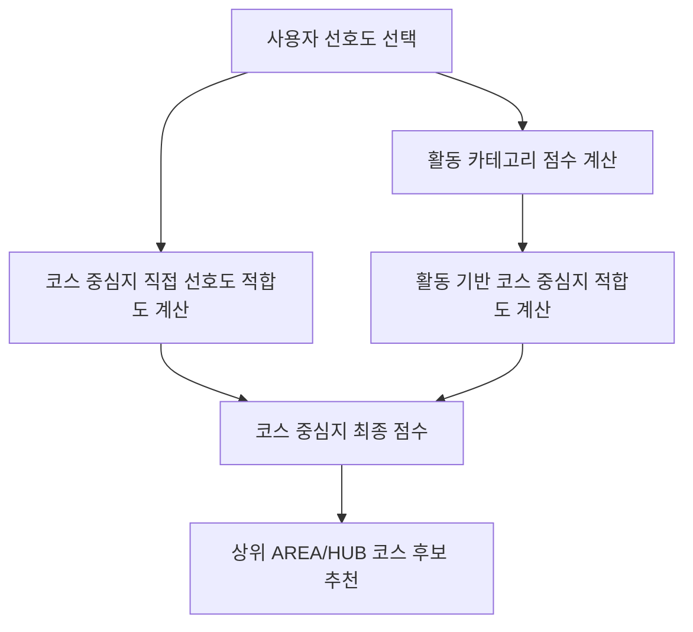

# 코스 중심지(CourseAnchor) 추천 흐름

## 개념

`CourseAnchor`는 코스를 시작할 기준점이다.

```text
AREA : 성수동, 서촌, 홍대·연남
HUB  : 아이파크몰, 코엑스, 더현대 서울
```

사용자는 선호도를 한 번만 선택하고, 서비스는 그 선택값으로 활동과 코스 중심지를 함께 계산한다.



## 계산식

```text
활동 점수
= 선택한 선호도 옵션이 활동 카테고리에 주는 가중치의 합

코스 중심지 직접 선호도 점수
= 선택한 선호도 옵션이 CourseAnchor에 주는 가중치의 합

활동 기반 코스 중심지 기여 점수
= Σ(보정된 활동 점수 × CourseAnchor 활동 가중치)

보정된 활동 점수
= min(max(활동 점수, 0), 100) / 100

코스 중심지 최종 점수
= 직접 선호도 점수 + 활동 기반 기여 점수
```

## 예시

```text
선택: 데이트 · 실내 · 조용한 · 사진

활동 점수
전시·문화 75점 / 공방·클래스 55점 / 쇼핑·구경 40점

성수동
사진 직접 적합도: +20
활동 기반 점수: 33.25
최종: 53.25점

서촌
조용한 직접 적합도: +20
활동 기반 점수: 22.75
최종: 42.75점
```

최종 점수 순으로 코스 중심지 후보를 보여주고, 사용자가 하나를 선택하면 해당 중심지 주변에서 실제 활동 장소·식당·카페를 추천한다.
